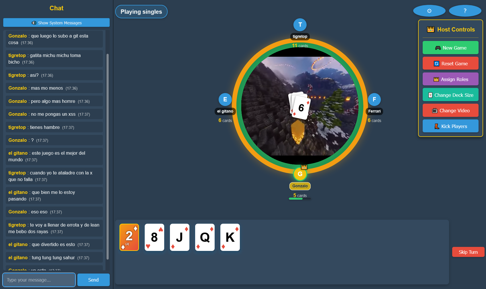

# ✨ Vibe-Cards 🃏

A web-based multiplayer card game "Culo" built with Flask, pure vibes only! 💯



## 🌟 Overview

Vibe-Cards is an implementation of the popular card game "Culo" that allows up to 12 players to play together in real-time. The game features a role system where players can be assigned different roles (President, Vice-President, Neutral, or Culo) based on their performance.

This is a fully vibe-coded project ✨, meaning it was created entirely by AI without writing a single line of code manually. The entire codebase, from backend logic to frontend design, was generated through AI assistance, embracing the modern "vibe coding" approach where developers describe what they want and AI handles the implementation. No code, just vibes. 😎

## 🔥 Features

- 👥 Supports up to 12 players
- ⚡ Real-time game updates
- 👑 Role system for tournament play
- 👀 Spectator mode for full games
- 📱 Responsive web interface
- 🤖 100% AI-generated code
- ✅ Zero manual coding, all vibes
- 🚫 Auto-kick inactive players after 3 turns

## 🎮 Game Rules

1. **Basic Play:** Players must play a card of equal or higher value than the top card on the table, or skip their turn. Simple vibes! 👌
2. **Ace Power:** Playing an Ace clears the table and grants an extra turn. Power move! 💪
3. **Two as Joker:** '2' cards can be played on any card and can represent any value. Wild vibes! 🃏
4. **Same Value Skip:** Playing a card with the same value as the previous card skips the next player. Gotcha! 😏
5. **Multiple Card Play:** Players can play multiple cards of the same value in a single turn. Stack 'em up! 🔄

## 🚀 Setup

1. Install dependencies:
   ```
   pip install -r requirements.txt
   ```

2. Run the application:
   ```
   python app.py
   ```

3. Access the game at `http://localhost:5000` and vibe out! 🎉

## 💻 Technologies

- 🐍 Backend: Flask
- 🎨 Frontend: HTML, CSS, JavaScript
- 🔐 Session Management: Flask sessions
- ✨ Development Approach: 100% AI-generated through vibe coding

## 🙌 Vibe With Us

No code, just vibes. That's how we roll in 2025! Feel free to fork, share, and spread the good vibes. Remember - why code when you can vibe? 😎✌️


## Meta Disclaimer
🐜 **Vibe Bugs:** This project is currently in buggy, but claude tried his best so be kind.

**Plot twist:** Even this README is 100% vibe coded! That's right - I didn't write a single word of this document either. Just vibed with the AI and it created this whole README while I sipped my coffee. The AI is writing about itself writing code... we're in deep, folks! Maybe the real code was the vibes we made along the way. 

⚠️ **Warning:** Excessive exposure to vibe coding may result in forgetting how to code manually, spontaneous usage of the 🔥 emoji, and telling everyone at parties that you're "more of a vibe architect than a developer." Side effects include increased productivity, decreased stress, and occasionally explaining to your boss that "the AI did it." ⚠️ 